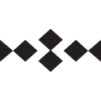

<div align="center">

<!-- Banner -->


<br/>

[](https://git.io/typing-svg)

<br/>

[](https://github.com/donus0)
[](https://www.linkedin.com/in/donus0)
[](https://t.me/donus0)

</div>

---

## About me

I'm a **Data Engineer** building production data platforms in **banking / fintech**, with hands-on experience across orchestration, warehousing, and **change-data-capture (CDC)** pipelines.

I work end-to-end — from source systems and streaming ingestion to modeled layers, quality checks, and analytics delivery — with a focus on **reliability**, **clear data contracts**, and **measurable outcomes** (faster refreshes, fewer manual jobs, safer migrations).

```text
  Sources ──► CDC / Batch ──► Orchestration ──► Warehouse ──► Analytics
   Oracle         Kafka            Airflow        Oracle / CH      BI
   MS SQL      + Debezium           DAGs & CI      stage/fact/mart   dashboards
```

**Education:** B.S. in Applied Mathematics & Computer Science (AI department), Kosygin University — Moscow · expected **2027**

---

## Professional experience

**Data Engineer** · Corporate Data Warehouse · *Ingosstrakh Bank* · Sep 2025 — present

- Migrated operational sources from **MS SQL Server → Oracle** while keeping downstream business logic intact.
- Built **streaming CDC** in dev: **Oracle → Apache Kafka (Debezium) → ClickHouse** for near-real-time analytics paths.
- Operate shared **Apache Airflow** environments: access patterns, resource sharing, and cross-team workflow design.
- Stack: **Airflow, Kafka, Debezium, Oracle PL/SQL, Docker, Git**

**Database Administrator → Data platform work** · Retail analytics · *Ingosstrakh Bank* · Jul 2024 — Aug 2025

- Designed and maintained **Oracle** data marts (200+ objects): partitioning, indexes, incremental loads, materialized views.
- Moved from schema-per-use-case to a dedicated **Oracle DWH** layout (stage / fact / BI layers) — **~50% faster** data refresh.
- Replaced scheduled **DBMS Jobs** with **Airflow-orchestrated** source-to-target (S2T) pipelines; introduced **GitLab CI** for DAG delivery.
- Delivered **data-quality** monitoring in **Visiology** and automated Outlook alerts from Airflow metadata + warehouse state.

---

## What I work on

| Area | Focus |
|------|--------|
| **CDC & streaming** | Oracle CDC with **Kafka + Debezium**; replication to **ClickHouse** |
| **Pipelines** | Batch ETL/ELT, idempotent loads, incremental models |
| **Orchestration** | **Apache Airflow** — DAG design, SLAs, retries, multi-team platforms |
| **Storage** | **Oracle**, **PostgreSQL**, **ClickHouse** — modeling, performance, migrations |
| **Engineering** | **Python** & **SQL**, **Docker**, **Git** / CI for reproducible data jobs |
| **Analytics enablement** | Metrics, client segmentation, BI (Visiology, Superset, Excel/Power Pivot) |

---

## Tech stack

<h3 align="left">Languages & core</h3>
<p align="left">
  <a href="https://www.python.org" target="_blank" rel="noreferrer">
    
  </a>
  
</p>

<h3 align="left">Data platforms & orchestration</h3>
<p align="left">
  <a href="https://airflow.apache.org/" target="_blank" rel="noreferrer">
    
  </a>
  <a href="https://kafka.apache.org/" target="_blank" rel="noreferrer">
    
  </a>
  <a href="https://debezium.io/" target="_blank" rel="noreferrer">
    
  </a>
  <a href="https://spark.apache.org/" target="_blank" rel="noreferrer">
    
  </a>
  <a href="https://clickhouse.com" target="_blank" rel="noreferrer">
    
  </a>
  <a href="https://www.postgresql.org" target="_blank" rel="noreferrer">
    
  </a>
  <a href="https://www.oracle.com/" target="_blank" rel="noreferrer">
    
  </a>
</p>

<h3 align="left">Infrastructure & tooling</h3>
<p align="left">
  <a href="https://www.docker.com/" target="_blank" rel="noreferrer">
    
  </a>
  <a href="https://git-scm.com/" target="_blank" rel="noreferrer">
    
  </a>
  <a href="https://www.linux.org/" target="_blank" rel="noreferrer">
    
  </a>
</p>

<p align="left">
  
  
  
  
</p>

---

## GitHub activity

<div align="center">


<br/>


</div>

---

## Currently exploring

- Production-hardening **Oracle CDC** (Kafka + Debezium) and **ClickHouse** consumption patterns  
- **Airflow** platform patterns: SLAs, lineage, and shared multi-tenant clusters  
- Stronger **data quality** gates and contract tests in pipeline design  

---

## Let's connect

<div align="center">

Interested in **data engineering**, **CDC/streaming**, or **enterprise DWH** work — especially **remote-friendly** roles. Happy to chat.

<br/>

[](https://github.com/donus0)
[](mailto:artiom.trenin@bk.ru)

</div>

<div align="center">
  <br/>
  
</div>
